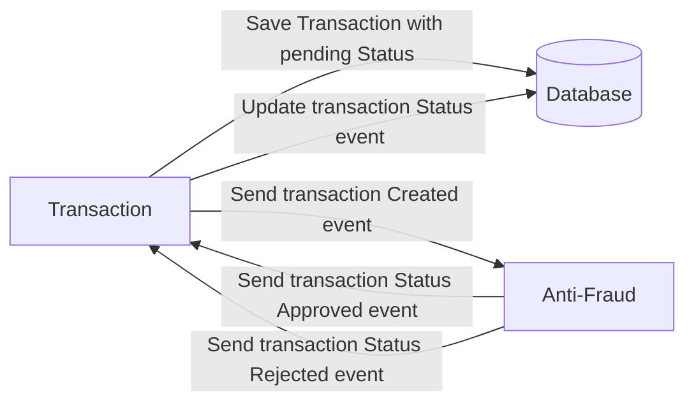
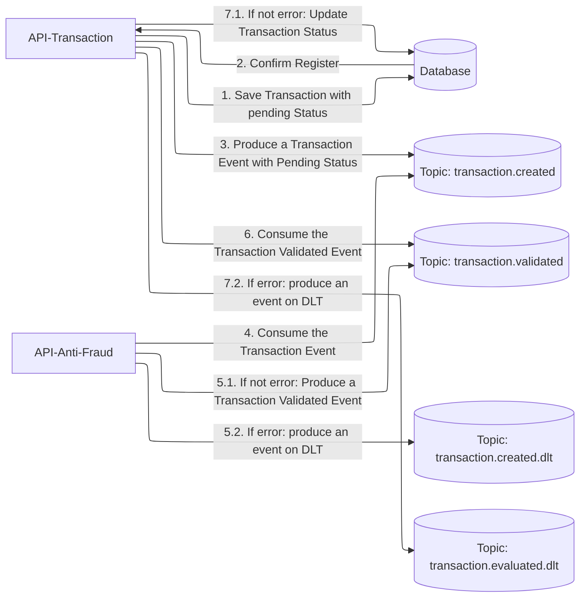

# Solución: Yape Code Challenge :rocket:

# Problem

Every time a financial transaction is created it must be validated by our anti-fraud microservice and then the same service sends a message back to update the transaction status.
For now, we have only three transaction statuses:

<ol>
  <li>pending</li>
  <li>approved</li>
  <li>rejected</li>  
</ol>

Every transaction with a value greater than 1000 should be rejected.



# Solución

### Diagrama de flujo


## 📋 Requisitos Previos

- **Docker Desktop** 4.x o superior
- **Docker Compose** 3.9 o superior
- Al menos **8GB de RAM** disponible para Docker
- Puertos disponibles: `1435`, `2181`, `9092`, `8080`, `8081`

## 🏗️ Arquitectura del Sistema

El proyecto contiene los siguientes servicios:

### Infraestructura Base
- **SQL Server 2022**: Base de datos principal (Puerto: 1435)
- **Zookeeper**: Coordinación de Kafka (Puerto: 2181)
- **Kafka**: Message broker para eventos (Puerto: 9092)
- **Kafka Init**: Inicializador de topics de Kafka

### Aplicaciones
- **yape-transactions-api**: API de transacciones (Puerto: 8080)
- **yape-anti-fraud-api**: API de detección de fraude (Puerto: 8081)

## 📂 Estructura del Proyecto

```
app-nodejs-codechallenge/
├── docker-compose.yml           # Orquestación de servicios
├── sqlserver/
│   ├── data/                    # Archivos de base de datos
│   ├── log/                     # Logs de SQL Server
│   └── init/
│       ├── init-yape.sh         # Script de inicialización
│       └── init-yape.sql        # DDL y datos iniciales
├── kafka/
│   └── create-topics.sh         # Creación de topics de Kafka
├── yape-transactions-api/
│   └── Dockerfile               # Imagen de API de transacciones
└── yape-anti-fraud-api/
    └── Dockerfile               # Imagen de API anti-fraude
```

## 🚀 Despliegue Paso a Paso

### Paso 1: Clonar o Descargar el Proyecto

```powershell
# Si usas Git
git clone https://github.com/yaperos/app-nodejs-codechallenge.git
cd app-nodejs-codechallenge

# O simplemente navega a la carpeta del proyecto
cd f:\tu_path\app-nodejs-codechallenge
```

### Paso 2: Verificar Docker Desktop

Asegúrate de que Docker Desktop esté ejecutándose:

```powershell
docker --version
docker-compose --version
```

### Paso 3: Limpiar Contenedores Anteriores (Opcional)

Si ya ejecutaste el proyecto antes:

```powershell
docker-compose down -v
```

### Paso 4: Construir las Imágenes

```powershell
docker-compose build
```

Este proceso puede tardar varios minutos la primera vez.

### Paso 5: Iniciar los Servicios

```powershell
docker-compose up -d
```

El flag `-d` ejecuta los contenedores en segundo plano.

### Paso 6: Verificar el Estado de los Servicios

```powershell
docker-compose ps
```

Todos los servicios deben mostrar estado `Up` o `healthy` con excepción del kafka-init que debe estar en `exited (0)`.

### Paso 7: Monitorear los Logs (Opcional)

```powershell
# Ver logs de todos los servicios
docker-compose logs -f

# Ver logs de un servicio específico
docker-compose logs -f yape-transactions-api
docker-compose logs -f yape-anti-fraud-api
docker-compose logs -f sqlserver
```

Presiona `Ctrl+C` para salir de los logs.

## ✅ Verificación del Despliegue

### Verificar SQL Server

```powershell
docker exec -it sqlserver2022-docker /opt/mssql-tools18/bin/sqlcmd -S localhost -U sa -P 'Yape2025.' -C -Q "SELECT name FROM sys.databases"
```

### Verificar Kafka Topics

```powershell
docker exec -it kafka kafka-topics --bootstrap-server localhost:9092 --list
```

### Verificar APIs

**API de Transacciones:**
```powershell
Invoke-WebRequest -Uri 'http://localhost:8090/actuator/health' -Method Get
```

**API Anti-Fraude:**
```powershell
Invoke-WebRequest -Uri 'http://localhost:8091/actuator/health' -Method Get
```

## 🧪 Pruebas del Sistema

### Crear una Transacción

```powershell
$body = @{
    accountExternalIdDebit = "db0123"
    accountExternalIdCredit = "cr1235"
    tranferTypeId = 1
    value = 920
} | ConvertTo-Json

Invoke-RestMethod -Uri 'http://localhost:8090/v1/transactions' -Method Post -ContentType 'application/json' -Body $body
```

### Consultar una Transacción

```powershell
# Reemplaza {transactionExternalId} con el ID devuelto en la creación
Invoke-RestMethod -Uri 'http://localhost:8090/v1/transactions/{transactionExternalId}' -Method Get
```

## 🔧 Configuración

### Credenciales de SQL Server
- **Usuario**: `sa`
- **Contraseña**: `Yape2025.`
- **Puerto Host**: `1435`
- **Base de Datos**: `YAPE`

### Kafka
- **Bootstrap Server (Externo)**: `localhost:9092`
- **Bootstrap Server (Interno)**: `kafka:29092`

### Variables de Entorno de las APIs

Ambas APIs comparten la misma configuración:
- `SPRING_THREADS_VIRTUAL_ENABLED`: `true`
- `SPRING_DATASOURCE_URL`: Conexión a SQL Server
- `SPRING_KAFKA_BOOTSTRAP_SERVERS`: `kafka:29092`

## 🛑 Detener el Sistema

### Detener servicios (conservar datos)

```powershell
docker-compose stop
```

### Detener y eliminar contenedores (conservar volúmenes)

```powershell
docker-compose down
```

### Detener y eliminar todo (incluye volúmenes y datos)

```powershell
docker-compose down -v
```

## 🔄 Reiniciar Servicios

```powershell
# Reiniciar todos los servicios
docker-compose restart

# Reiniciar un servicio específico
docker-compose restart yape-transactions-api
```

## 📊 Monitoreo y Debugging

### Ver recursos utilizados

```powershell
docker stats
```

### Acceder a un contenedor

```powershell
# SQL Server
docker exec -it sqlserver2022-docker bash

# Kafka
docker exec -it kafka bash

# Aplicaciones
docker exec -it yape-transactions-api bash
docker exec -it yape-anti-fraud-api bash
```

### Ver logs en tiempo real

```powershell
docker-compose logs -f --tail=100
```

## ⚠️ Troubleshooting

### Problema: Puertos en uso

Si los puertos están ocupados, modifica `docker-compose.yml`:

```yaml
ports:
  - "NUEVO_PUERTO:PUERTO_INTERNO"
```

### Problema: SQL Server no inicia

Verifica que tienes suficiente RAM disponible y que los archivos de datos no estén corruptos:

```powershell
docker-compose logs sqlserver
```

### Problema: Kafka no está listo

Espera a que el healthcheck de Kafka esté `healthy`:

```powershell
docker-compose ps kafka
```

### Problema: APIs no se conectan a la BD

Verifica que SQL Server esté saludable antes de iniciar las APIs:

```powershell
docker-compose up -d sqlserver
# Espera ~30 segundos
docker-compose up -d
```

## 📝 Notas Adicionales

- Los datos de SQL Server persisten en `./sqlserver/data`
- Los logs de SQL Server se almacenan en `./sqlserver/log`
- La inicialización de la BD se ejecuta automáticamente con `init-yape.sh`
- Los topics de Kafka se crean automáticamente con el servicio `kafka-init`
- Las APIs usan hilos virtuales de Java (Project Loom) habilitados

## 🔗 Endpoints Principales

- **Transactions API**: http://localhost:8090
  - Health: http://localhost:8090/actuator/health

- **Anti-Fraud API**: http://localhost:8091
  - Health: http://localhost:8091/actuator/health

## 👥 Soporte

Para problemas o consultas, revisa los logs de los servicios:

```powershell
docker-compose logs -f <nombre-servicio>
```

---

**Última actualización**: Diciembre 2025
